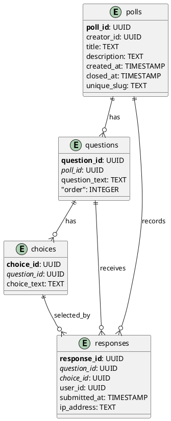
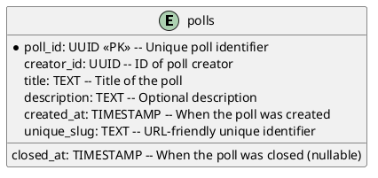
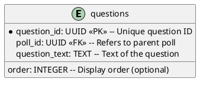
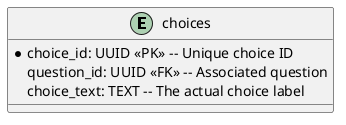
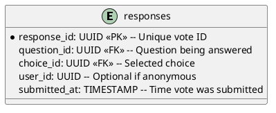
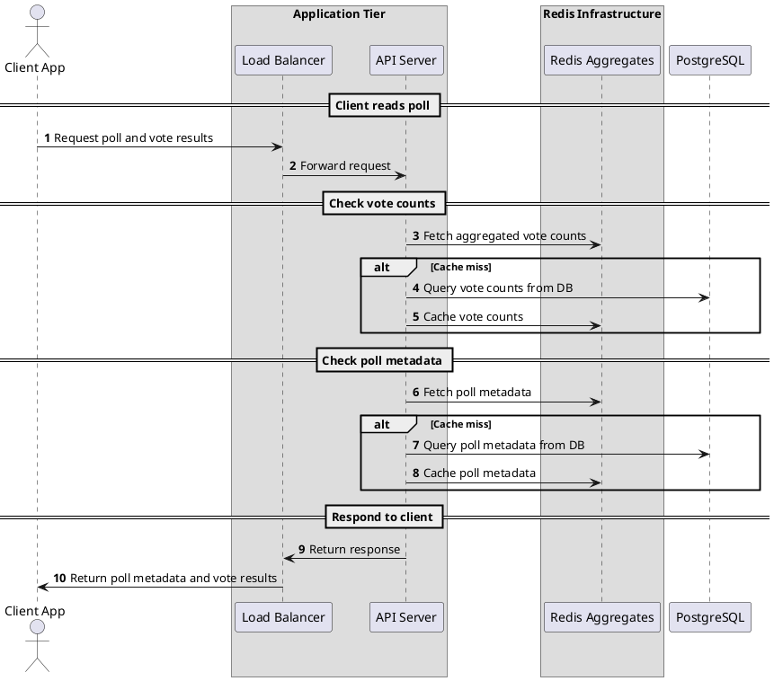
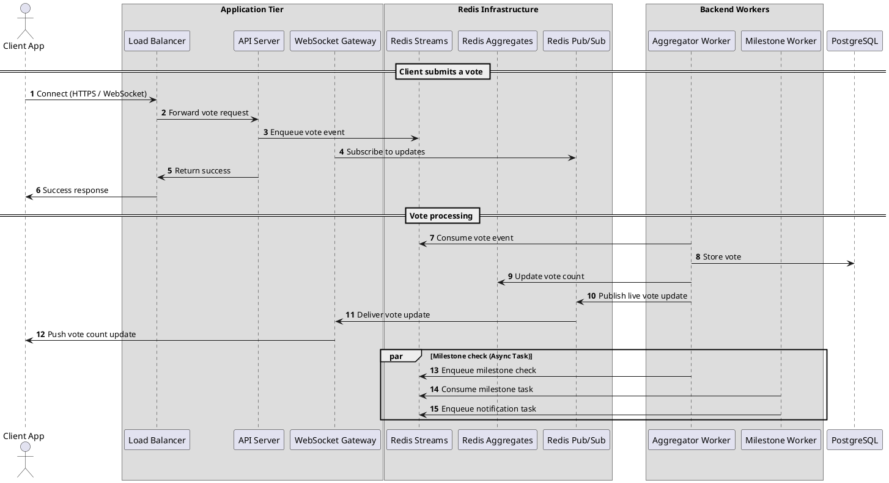

Below outlines a proposed design for the Pollster system. The goal is to build a scalable, real-time polling system that can smoothly handle millions of users, even when polls go viral.

### Assumptions

1. **Frontend is out of scope**  
    Assume a frontend (e.g. SPA or mobile app) exists and will integrate with the backend, but its implementation is not part of this design.
    
2. **Authentication is handled**  
    User sign-up, login, and authentication are already implemented and functional.
    
3. **Security is out of scope**  
    While security is important, detailed security considerations are outside the scope of this document.

## ✅ Overview of System Requirements

- Immutable polls with multiple-choice questions
    
- Real-time updates of aggregated poll results
    
- High scalability and durability
    
- Fault tolerance and extensibility
    

### Background Tasks

- Send milestone notifications
    
- Periodic archival
    

---

## Data Estimates

Here's a quick, informal calculation to understand Pollster’s performance, scale, and infrastructure requirements.

### Assumptions

- **Active polls at peak:** 100 polls
    
- **Votes per second per poll:** 10 votes/sec
    
- **Active concurrent viewers per poll:** ~10,000 users
    

### Analysis

#### 📊 Vote Write Throughput

- `100 polls × 10 votes/sec per poll = 1,000 votes/sec`
    

#### 📊 Data Ingestion (Database Storage)

- **Per second:** `1,000 votes/sec × 226 bytes (estimated key size) ≈ 226 KB/sec`
    
- **Per day:** `226 KB/sec × 86,400 sec/day ≈ 19.5 GB/day`
    

#### 📊 Redis Streams & Hashes

- **Redis Streams Throughput:**
    
    - 1,000 events/sec (votes) are easily handled by Redis ([>10K ops/sec](https://devopedia.org/redis-streams#qst-ans-7))
        
- **Redis Hash Memory Usage:**
    
    - `46 bytes (estimated key size) + 8 bytes (integer value) ≈ 54 bytes per choice entry`
        
    - `(100 polls × 5 choices/poll) × 54 bytes ≈ 27 KB total` (negligible)
        

---

## 🗄️Database Design (PostgreSQL)

PostgreSQL is a great initial choice for Pollster because:

- Widely adopted across many enterprises and startups
    
- Great documentation and active community
    
- Natural fit for modeling structured relationships (polls, questions, choices)
    
- Strong ACID guarantees for consistency and auditability
    
- Built-in scalability features (partitioning, indexing)

#### NOSQL vs Relational

I did not suggest NoSQL because the data is relational — polls have questions, questions have choices, and responses tie it all together. It’s easier and safer to manage that kind of structure in a relational database, and we get things like consistency, joins, and reliable queries out of the box with PostgreSQL.

### 📌 Table Schema



### 📌 Polls Table



Holds high-level metadata about each poll. Polls are immutable after creation, except for their `closed_at` field. The field `unique_slug` will allow unique URL lookups to satisfy our requirements. 

### 📌 Questions Table



Each poll can have multiple questions which allows flexibility for future multi-question polls.

### 📌 Choices Table



Holds the predefined answers for each question. Users can select from these during voting.

### 📌 Responses Table



Stores every individual vote submitted by users. Acts as a durable audit trail for aggregation and analytics. Add constraints in the table to ensure a user has only voted on a question once.


---

## ⚡Redis

Reliable, asynchronous vote event processing:

- Sharded streams for horizontal scalability
    
- Ordered vote handling ensures accurate processing
    
- Redis Streams can handle thousands of events/sec

Pollster should use Redis to handle the real-time side of voting. Streams let us queue incoming vote events for workers to process reliably, hashes track live vote counts so we can read them super fast, and pub/sub pushes updates out to WebSocket servers instantly. It keeps things fast and responsive, and it separates real-time concerns from our database, which helps with scale and resilience.

#### 🧵 Votes

**Key Format:** `poll:votes:stream-{shard_id}`

**Example Event:**

```json
{
  "poll_id": "abc123",
  "question_id": "456",
  "choice_id": "789",
}
```
#### 🧵 Milestone Calculation

**Key Format:** `milestone:stream-{shard_id}`

**Example Event:**

```json
{
  "poll_id": "abc123",
  "total_votes": 10000
}
```
#### 🧵 Notify  

**Key Format:** `notify:stream-{shard_id}`

**Example Event:**

```json
{
  "poll_id": "abc123",
  "type": "milestone",
  "recipient_id": "user-456",
  "message": "Your poll just hit 10,000 votes!"
}
```

#### 🧵 Archival 

**Key Format:** `archival:stream-{shard_id}`

**Example Event:**

```json
{
  "poll_id": "abc123",
  "event": "poll_closed",
  "closed_at": "2025-03-27T20:00:00Z"
}
```


#### 🧮 Redis Hash (Aggregates)

- Atomic counters for real-time vote totals
    
- Ultra-fast updates, even under heavy load
    

**Key Format:** `poll:{poll_id}:counts`

**Example:**

```json
{
  "choice:789": 1540,
  "choice:790": 1200,
  "choice:791": 230
}
```


#### 📨 Redis Pub/Sub Channel

- Efficiently notifies WebSocket nodes
    
- Enables real-time updates without DB polling
    

**Channel Name:** `poll:{poll_id}:updates`

**Example Message:**

```json
{
  "poll_id": "123",
  "results": {
    "choice:789": 1540,
    "choice:790": 1200,
    "choice:791": 230
  }
}
```

Pub/Sub enables stateless communication for websockets which helps in horizontally scaling the service with increased demand.

---

## Architecture Diagram

### 🐦 Bird's-eye View

Pollster is built for high-scale, real-time polling. Users vote and view results in a web app. Votes stream through Redis, are processed by workers, stored in PostgreSQL, and broadcast in real time via WebSockets.


```plantuml
@startuml
!includeurl https://raw.githubusercontent.com/plantuml-stdlib/C4-PlantUML/master/C4_Container.puml

Person(user, "User")

Container(webapp, "Pollster Web App", "React", "Frontend for creating and voting on polls")
Container(backend, "Backend API + WebSocket", "Python", "Handles poll logic, voting, and live updates")
Container(data, "Data Layer", "Redis + PostgreSQL", "Stores poll data and real-time vote counts")
Container(workers, "Worker Services", "Python", "Processes votes, closes polls, sends notifications")

Rel(user, webapp, "Uses")
Rel(webapp, backend, "Sends requests and receives updates")
Rel(backend, data, "Reads/writes data")
Rel(backend, workers, "Dispatches background tasks")
Rel(workers, data, "Processes votes and poll results")

@enduml

```

### 🔍 Detailed View


Everything is stateless, message-driven, and horizontally scalable. Redis is split by concern, and worker pools make ingestion and background jobs resilient under load.


```plantuml
@startuml
!includeurl https://raw.githubusercontent.com/plantuml-stdlib/C4-PlantUML/master/C4_Container.puml

' Icon libraries
!define DEVICONS https://raw.githubusercontent.com/tupadr3/plantuml-icon-font-sprites/master/devicons
!define FONTAWESOME https://raw.githubusercontent.com/tupadr3/plantuml-icon-font-sprites/master/font-awesome-5

!include DEVICONS/react.puml
!include DEVICONS/python.puml
!include DEVICONS/postgresql.puml
!include DEVICONS/redis.puml
!include FONTAWESOME/server.puml
!include FONTAWESOME/cogs.puml
!include FONTAWESOME/cloud.puml

' People
Person(user, "User", "Creates polls, votes, views results, deactivates polls")

' Frontend
Container(spa, "Pollster Web App", "React", "Client interface for creating polls, voting, deactivating polls, and viewing results", $sprite="react")

' Load balancer and scalable app nodes
Container_Boundary(appTier, "Web Application Tier (Scaled)") {
  Container(lb, "Load Balancer", "Layer 4/7", "Routes HTTP and WebSocket traffic")
  Container(api, "API Server", "Python + Django", "Stateless REST & WebSocket backend. Scaled horizontally.", $sprite="python")
  Container(ws, "WebSocket Gateway", "Python", "Delivers real-time updates to clients", $sprite="server")
}

' Redis cluster for real-time stream & pubsub
Container(redisStream, "Redis Streams", "Redis", "Sharded stream for ingesting and processing vote events", $sprite="redis")
Container(redisHash, "Redis Aggregates", "Redis", "Hash structure for storing live aggregated vote counts", $sprite="redis")
Container(redisPubSub, "Redis Pub/Sub", "Redis", "Broadcast channel for real-time poll updates", $sprite="redis")

' Scalable aggregation and background task workers
Container_Boundary(workerPool, "Worker Pool") {
  Container(aggregator, "Aggregator Worker", "Python", "Processes vote streams, updates aggregates and DB", $sprite="cogs")
  Container(background, "Background Worker", "Python", "Handles poll archival, closure, and milestone notifications", $sprite="cogs")
}

' Data storage
ContainerDb(pg, "PostgreSQL", "PostgreSQL", "Stores polls, questions, choices, and vote records", $sprite="postgresql")
Container(archive, "Object Storage", "Cloud Storage", "Long-term archive for closed polls and exports", $sprite="cloud")

' Relationships
Rel(user, spa, "Uses")
Rel(spa, lb, "Sends requests and connects to WebSocket")
Rel(lb, api, "Routes HTTP requests")
Rel(lb, ws, "Routes WebSocket connections")

Rel(api, redisStream, "Publishes vote events")
Rel(api, redisHash, "Reads vote counts")
Rel(api, redisPubSub, "Publishes real-time updates")
Rel(api, ws, "Establishes WebSocket session")

Rel(ws, redisPubSub, "Subscribes to updates")
Rel(ws, spa, "Sends live updates")

Rel(aggregator, redisStream, "Consumes vote events")
Rel(aggregator, redisHash, "Updates vote counts")
Rel(aggregator, pg, "Inserts vote records")
Rel(aggregator, redisPubSub, "Publishes updates")

Rel(background, pg, "Reads poll metadata and votes")
Rel(background, archive, "Archives data")
Rel(background, api, "Triggers notifications")

@enduml

```


**Stateless frontend & backend:**      
    Both the API server and WebSocket gateway are stateless, which means we can scale them horizontally behind load balancers. Spin up more instances, and they just work — no sticky sessions or shared memory to worry about. When traffic spikes (say, a poll goes viral), a load balancer can route requests to any healthy instance.
    
- **Real-time updates via Pub/Sub:**  
    
    WebSocket servers subscribe to Redis Pub/Sub channels. When a vote gets processed, an update is published and all the WebSocket servers get it — simple and efficient. No polling or DB hits from the client side.
    
    
- **Redis roles:**  
    Redis is used in three different contexts. Each are logically separate and, from the infrastructure perspective we can scale or shard each independently as traffic grows:
    - **Streams** for ingesting raw vote events
    - **Hashes** for keeping live aggregated counts
    - **Pub/Sub** for broadcasting updates  
    
    
- **Parallel worker processing:**  
    Aggregator workers read from Redis Streams using consumer groups — so we can run multiple in parallel to handle vote spikes. Background workers (like for archival or milestone notifications) scale separately too.


### Session Diagrams

#### 📖 Reading Votes

Below is a proposed workflow for users reading real-time votes.



#### 🗳️ Submit Vote

Below is a proposed workflow for users to submit votes.



## 💡 Future Thoughts

One thing I’d recommend exploring is change data capture (CDC) from PostgreSQL to Redis. Right now, we're writing to both systems — the database for durability, and Redis for real-time aggregation — which creates a dual write situation. That opens the door to inconsistencies if one write succeeds and the other fails. With CDC, we’d treat PostgreSQL as the single source of truth and stream inserts or updates directly into Redis. This removes the need for application-level dual writes and simplifies our logic. It also guarantees Redis stays consistent with what's actually stored in the database, which is a big win for correctness — especially as we scale. Additionally, I did not account for partitioning the database, autoscaling, or consider replication. This would greatly improve our reliability on the PostgreSQL-side of things. Cloudflare could be a nice additional layer of security - [they are a trusted and reliable solution for ingress traffic](https://www.cloudflare.com/application-services/products/ddos-for-web/) within the Pollster network.

We could also expand our user tracking to support more personalized notifications — for example, sending nudges to users who haven’t voted in a while, or generating daily or weekly digests that highlight polls they’ve created or engaged with. These types of triggers would run as background jobs and push events into the same notification stream, so the notification system stays decoupled but flexible.

